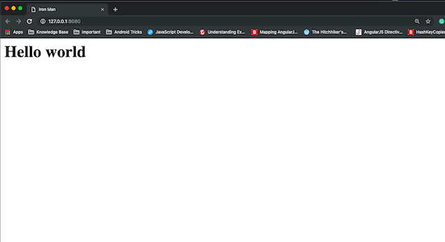
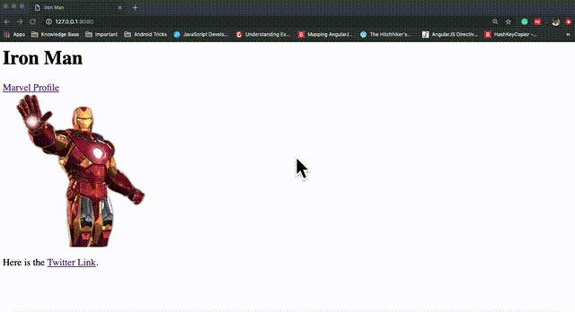
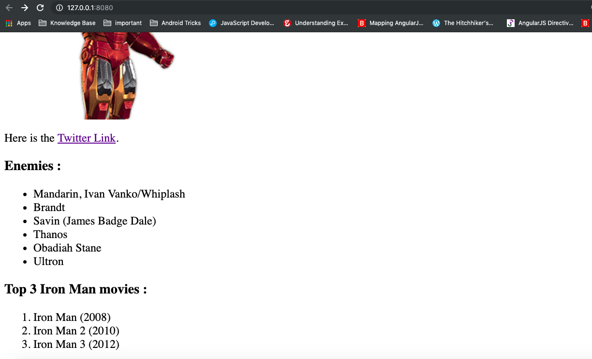
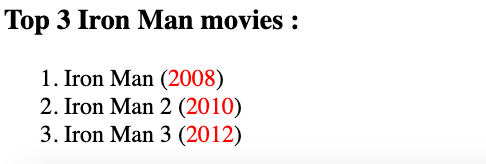
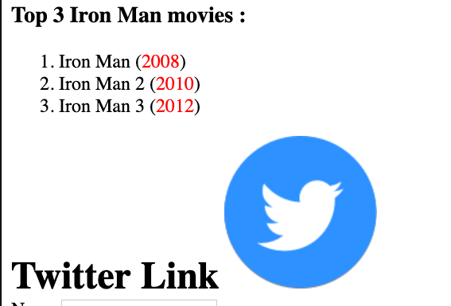
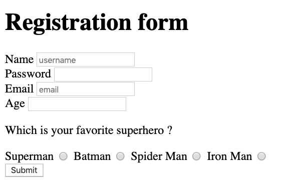
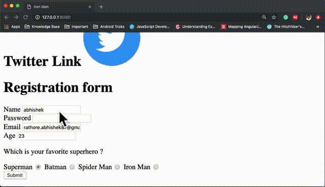
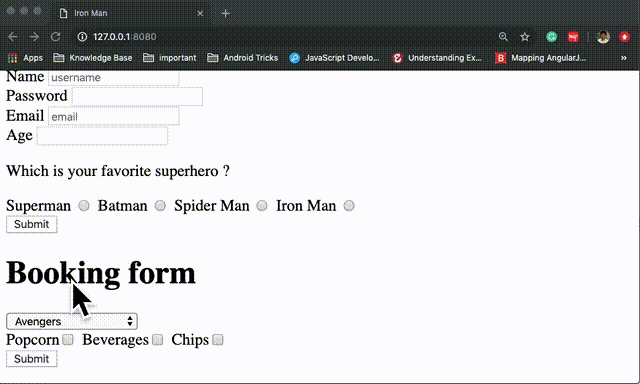
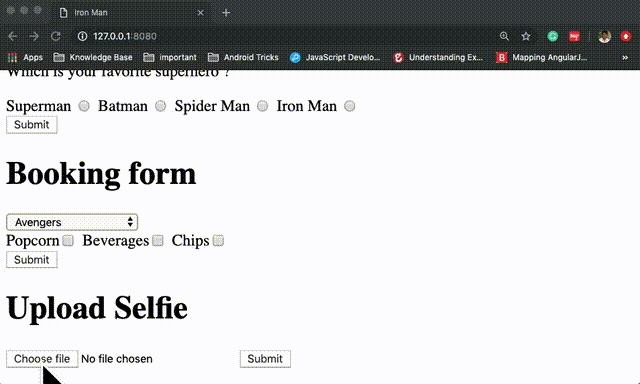

# HTML Basics - Youstart Labs

Read the Basics of HTML from slides (PDF) [Link to Slide]().

Complete the below topics and their exercises. 

* Setup HTTP Server
* Common HTML tags
* HTML List
* `div` and `span`
* Block vs Inline Elments
* Chrome Explorer DevTool
* HTML Forms and different type of inputs
* Form `name` and `value` attributes
* `GET` and `POST` Type of request

# Lab Exercise

## 1. Setup HTTP server

```javascript
 npm install -g http-server
```

* Create a Simple Web Page with `head`, `body` and `title`. Make title as `Iron Man` and body as simple heading `Hello World`. Save file as `index.html`. 
* Use `http-server` command in `cmd` or `terminal`. Make sure you run the command from inside of same directory where  `index.html` is.
* Open `http://localhost:8080` in your chrome browser to checkout the page.

### Output




## 2. Common HTML Tags 

Use commong HTML tags heading (h1- h6), Anchor tag(a), Image tag(img), div, para(p) etc. 

* Marvel Profile Link : `https://www.marvel.com/characters/iron-man-tony-stark`
* Tony Stark Twitter Link : `https://twitter.com/Iron_Man`
* Link on Image : `https://www.superherostuff.com/biographies/ironmanbiography.html`

Make sure links open in a new tab as shown in Output

### Output




## 3. HTML List

Use HTML List (ordered and unordered) 

### Output



## 4. Div and Span

Use `span` to color year part of list . Use `style="color: red"` attribute to provide color to span.

### Output



## 5. Block and Inline element
Only use `h1` and `img` tags to accomplish this task.
Add "Twitter Link" text and put Twitter icon in front of it. As `h1` tags are block element - Convert `block` to `inline` elements to complete this task. 
Use `style="display:<value>"` property where `<value>` will be changed according to need.

### Output



## 6. Registration form

Create a HTML form as shown in output. Make sure you have exact output.

### Output




## 7. Registration form with Values

Make these changes to your form:
* Add `name` attributes as `username`, `pass`, `email` and `age` to  input tags
* Add `action` attribute with value `https://hidden-ridge-64485.herokuapp.com/registration` and `method` with value `GET`
* Submit and verify the result

### Output




## 8. Booking form 

Create a new form with `select` and `checkbox` inputs

Make these changes to this form:
* Add `name` attributes as `movie` to `select` input
* Create `option` with `value` attributes as name of movie respectively.
* Add `name` attributes as `addon` to all `checkbox` inputs and `value` attributes as `popcorn`, `beverages` and `chips`

* Add `action` attribute with value `https://hidden-ridge-64485.herokuapp.com/booking` and `method` with value `POST`
* Submit and verify the result


### Output




## 9. Selfie Upload 

Create a new form with `file` inputs.

Make these changes to this form:
* Add `name` attributes as `file` to `file` input
* Add `method` as `POST` and  `enctype` as `multipart/form-data` to the Form tag.
* Add `action` attribute with value `https://hidden-ridge-64485.herokuapp.com/selfie`
* Submit and verify the result

### Output




