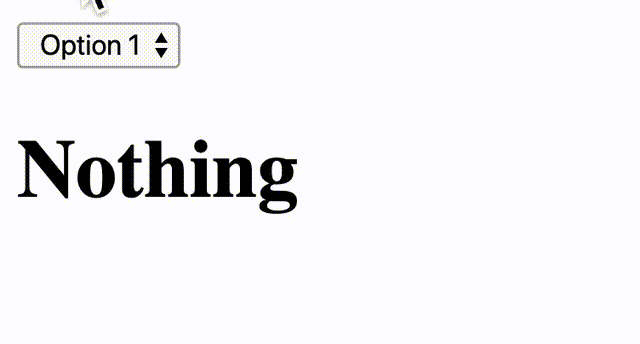

# DOM / Web API


DOM is acronym for Document Object Model, this is how your represent all your web page elements (HTML,CSS) in a Javascript Object format.


## DOM Structure

Let's see how a simple HTML element can be converted in DOM (JS object)

```HTML
  <h1 id="heading" class="bold" style="color:red;font-size:14px;"> Hello World </h1>
```

This above element is represented in DOM as (not exactly same) :

```javascript

var h1 = {
    innerText : "Hello World",
    style : {
        color:"red",
        font-size:"14px"
    }
    attributes:{
        id : "heading",
        class : "bold"
    }
}
```

Now if you want to change some property of this Object by programming, you can use simple JS programming. Some examples are show below :


```javascript
h1.style.color = "green"   //changes font color to green


var i=0;
setInterval(()=>{ h1.innerText = i; i++  }, 300) // runs this every 300 miliseconds and changes innerText of h1 to a new number;
```


## Selecting an Element using document Object


`document` object is the parent object of every element. `document` represents the complete HTML document. You can use some of its method to select the right element. Once you have selected the element you can perform JS operations on it to make some changes.

* `getElementById(id)` : For selecting HTML Element using `id`
* `getElementsByTagName(name)`: For selecting Elements by Tag Names 
* `getElementsByClassName(name)`:  For selecting Elements by Class Names 

To Select a HTML element of this type:

```HTML
  <h1 id="heading" class="bold" style="color:red;font-size:14px;"> Hello World </h1>
```

One has to write a code similar to this in JS :

```javascript
  var h1 = document.getElementById("heading")

 // do some operations on h1 as shown above like changing changing innerText

```


## Element Object

The `h1` element selected above is just one of selected elements. Every element has few property and functions which we can use to change the Object. The DOM object doesn't behave as simple JS object - so we can't change all properties by simply 'dot' notation. e.g we can't do `h1.attributes.id = "newID"` we will have to use `setAttribute` method

* `value` : Form input box values (of any input type)
* `innerHTML` : For changing inner HTML of an element
* `style`: for changing style of an element
* `setAttribute(attrName,value)` : for setting an attribute to an element
* `getAttribute(attrName)` : for getting an attribute to an element
* `appendChild(element)`: for appending a child element to Parent Element

Some examples :

### 1. Make a counter from h1 heading tag; 

HTML element :

```HTML
  <h1 id="heading" class="bold" style="color:red;font-size:14px;"> Hello World </h1>
```
JS code :

```javascript
var h1 = document.getElementById("heading")

var i=0;
setInterval(()=>{ h1.innerText = i; i++  }, 300)   // make a counter on your page.


h1.style.color = "green" ;   // change color

h1.setAttribute('class', 'big');   //change class
h1.getAttribute('class');     

```


### 2. Rotate the image 

```HTML
  
```
JS code :

```javascript
  var img = document.getElementById("image");
  var i=0;
function rotate(i){
    img.style.transform = "rotate("+i+"deg)"
    }
setInterval(
    function(){
       rotate(i);
       i=i+5;
    },300)  // run rotate function every 300 msecs

```


# Browser Event Handling in HTML

Now that you have seen how you can change HTML elements from JS. You can use some events which can invoke JS functions from HTML elements. For example `running a function on click of a button`

You can use some of common attribute to connect to Browser events in HTML

* `onclick()` : on clicking the element on which you have 
* `onfocus()` : on focusing on a input box. When you click inside the box. 
* `onblur()` : when you move out of a element(like click outside input box)
* `onmousemove()` : when you move your mouse
* `onchange()` : when there is a change in value of a input (like dropdown selected)
* `onmouseover()` : when you move your mouse inside an element
* `onmouseout()` : when you move your mouse out of an element
* `onkeypressed()` : when you press a keyboard key.

Let's see some commond example :


### 1. Do something on click of a Button

```HTML
 
 <button onclick="counter()"> CLICK </button> 
 
 <h1 id="heading"> Hello World </h1>

```

```js

var h1 = document.getElementById("heading")

var i=0;
function counter(){
    setInterval(()=>{ h1.innerText = i; i++  }, 300)
} 

```


### 2. Do something on changing of input

Here is the dropdown box

```HTML
 
 <select id="box" onchange="show(event)"> 
    <option value="option1">Option 1</option>
    <option value="option2">Option 2</option>
 </select> 


 <h1 id="heading">Nothing</h1>

```
This is Javascript code required to change innerText

```js

var h1 = document.getElementById("heading")

function show(event){
    h1.innerText = event.target.value
}

```




