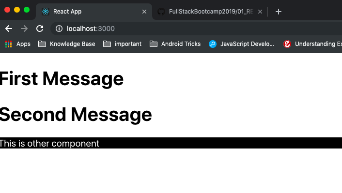
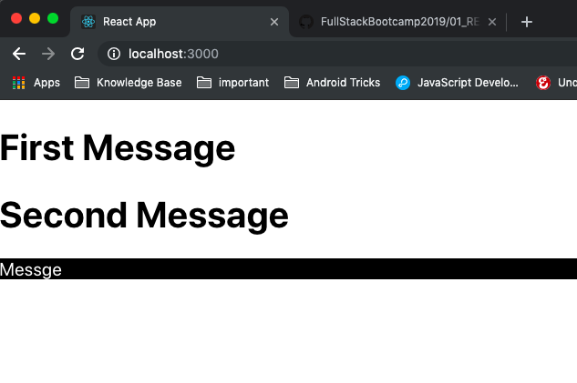
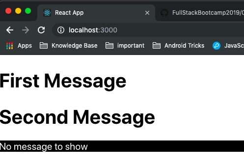

# REACT

## 1. Basic Setup using npm

Go to directory where you want to start new React project. Run this command to create a new project. You can change `my-app` to any other name of your project.

```javascript
npx create-react-app my-app
```

Once installed - move to the project directory in terminal (e.g. cd my-app)

Start your project by running the following command

```javascript

npm start
```

### Output


## 2. Change the App Component

Go to `App.js` and remove everything from the `return` part of function. After removing just return `<h1>Hello React</h1>` from your function. Save the file to see the output on browser

### Output


## 3. Change the JSX to have 2 Elements

Add one more `<h1>Hello React</h1>` in your return function. You should observe an error in browser at this moment. We can't return 2 elements as once. So, create a new parent element `div` which contains both `h1` heading. Check the output

### Output


## 4. Convert App component to Arrow function

Convert `function App` into arrow functions of ES6 standards. Output will still show the same thing browser.


## 5. Create Second Component

Create new component called `OtherComponent` it should return `<p>This is other component</p>`. Attach this component to `App` component after the 2 `h1` headings.

### Output


## 5. Add Style to the Component

Open `App.css` and remove all text conent from it. Create a class named `styled` with background `black` and text color `white`.
Add `className` `styled` to paragrah in `OtherComponent`.

### Output


## 6. Functional components & Props

In React components can be made in 2 styles, functional components or class components. Till now we have made `App` and `OtherComponent` which are functional components. We can pass `props` in functional components as first argument.

Let's pass and argument called `props` in `OtherComponent`. These props will contain all the attributes passed in `OtherComponent` as JS object.

You can use it as  `<OtherComponent cName='styled'/>`. This will be availble in function as `props.cName`. change the `className` value to `{props.cName}` and check the output.

Pass  props  in App Component `<App msg1='First Messgae' msg2='Second Messgae'/>`. use this `props.msg` in `h1` headings and check output.

### Output




## 7. Using if-else in components

In `OtherComponent` use `props` & `if` `else` statement to create an output like below :

1. When `msg` props is given - it should show the `msg` value in paragraph

### Output





2. When `msg` props is not given - it should show this message `No message to show`

### Output




## 7. Using ternary operators (?:)

In `OtherComponent` use `props` & `ternary operators`  to create an output like previous exercise.


## 8. Using For loop

In `App` use `for` loop to create the two Headings `h1` which are written before. You have to pass the two messages in single argument as an Array  e.g `<App msg={["First Message","Second Message"]} />`

As you can't concat JSX elements you will have to create an Array of JSX elements and push both `h1` elements. Finally, use this function as follows, where `messages` function will use `for` loop

```javascript
 <div>
      {messages()}
    <OtherComponent cName="styled" msg="hello react"/>
</div>

```

## 9. Using .map() for looping

Create the same output using `.map()` function on `props.msg`


