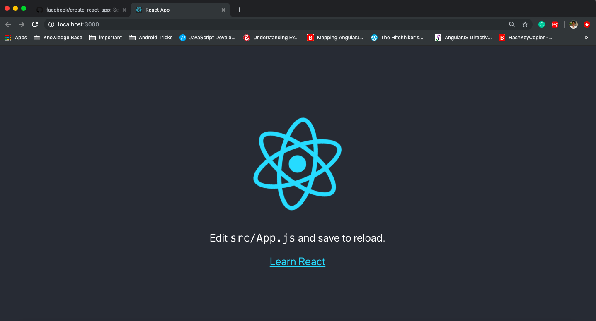
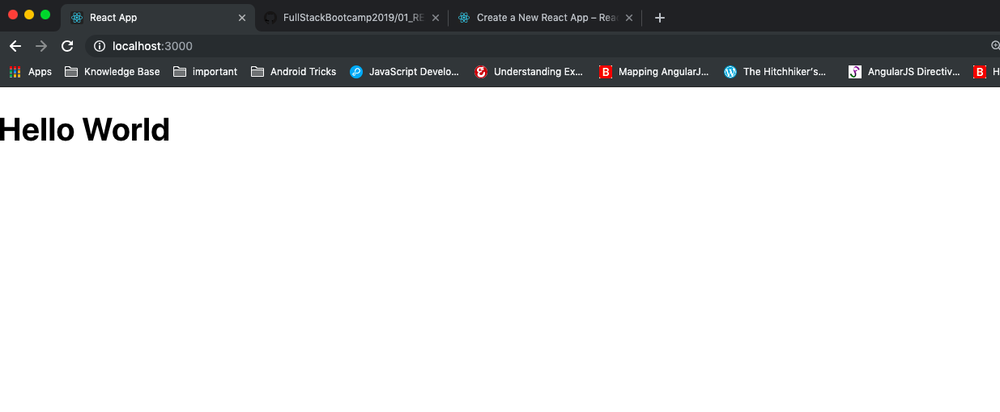
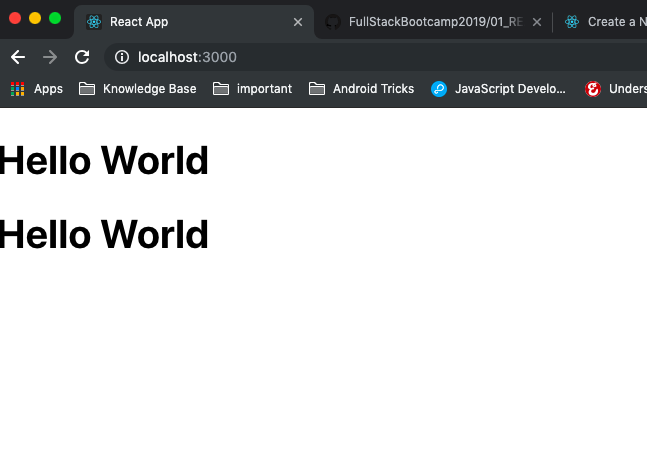
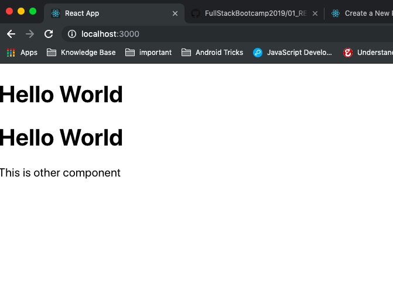
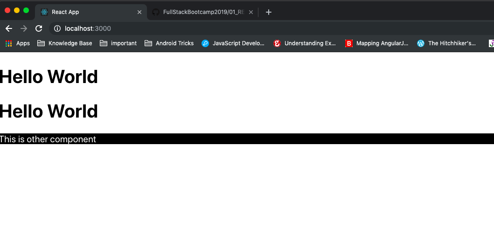
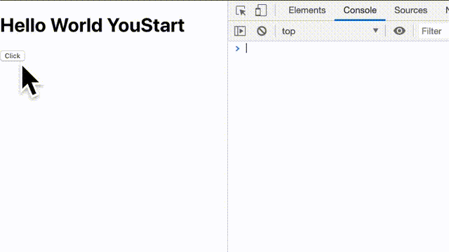
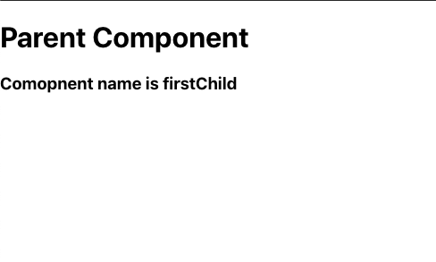

# REACT

## 1. Basic Setup using npm

Go to directory where you want to start new React project. Run this command to create a new project. You can change `my-app` to any other name of your project.

```javascript
npx create-react-app my-app
```

Once installed - move to the project directory in terminal (e.g. cd my-app)

Start your project by running the following command

```javascript

npm start
```

### Output




## 2. Change the App Component

Go to `App.js` and remove everything from the `return` part of function. After removing just return `<h1>Hello React</h1>` from your function. Save the file to see the output on browser

### Output



## 3. Change the JSX to have 2 Elements

Add one more `<h1>Hello React</h1>` in your return function. You should observe an error in browser at this moment. We can't return 2 elements as once. So, create a new parent element `div` which contains both `h1` heading. Check the output

### Output




## 4. Convert App component to Arrow function

Convert `function App` into arrow functions of ES6 standards. Output will still show the same thing browser.


## 5. Create Second Component

Create new component called `OtherComponent` it should return `<p>This is other component</p>`. Attach this component to `App` component after the 2 `h1` headings.

### Output



## 5. Add Style to the Component

Open `App.css` and remove all text conent from it. Create a class named `styled` with background `black` and text color `white`.
Add `className` `styled` to paragrah in `OtherComponent`.

### Output



## 6. Functional components & Props

In React components can be made in 2 styles, functional components or class components. Till now we have made `App` and `OtherComponent` which are functional components. We can pass `props` in functional components as first argument.

Let's pass and argument called `props` in `OtherComponent`. These props will contain all the attributes passed in `OtherComponent` as JS object.

You can use it as  `<OtherComponent cName='styled'/>`. This will be availble in function as `props.cName`. change the `className` value to `{props.cName}` and check the output.

Pass  props  in App Component `<App msg1='First Messgae' msg2='Second Messgae'/>`. use this `props.msg` in `h1` headings and check output.

### Output


## 7. Using if-else in components

In `OtherComponent` use `props` & `if` `else` statement to create an output like below :

1. When `msg` props is given - it should show the `msg` value in paragraph

### Output


2. When `msg` props is not given - it should show this message `No message to show`

### Output


## 7. Using ternary operators (?:)

In `OtherComponent` use `props` & `ternary operators`  to create an output like previous exercise.


## 8. Using For loop

In `App` use `for` loop to create the two Headings `h1` which are written before. You have to pass the two messages in single argument as an Array  e.g `<App msg={["First Message","Second Message"]} />`

As you can't concat JSX elements you will have to create an Array of JSX elements and push both `h1` elements. Finally, use this function as follows, where `messages` function will use `for` loop

```javascript
 <div>
      {messages()}
    <OtherComponent cName="styled" msg="hello react"/>
</div>

```

## 9. Using .map() for looping

Create the same output using `.map()` function on `props.msg`

```javascript

   function App(props){
   const JSX = props.msg.map((elem)=>(<h1>{elem}</h1>))
   }

```
maps are easy way to iterate over a collection and return a modified collection


## 10. Using Destructured props

You can use props in a destructured object format for easy access

```javascript

   function App({msg}){
         const JSX = msg.map((elem)=>(<h1>{elem}</h1>))
   }   // destructured prope into  {msg} so we can use msg instead of props.msg

```


## 11. Using PropTypes

PropTypes is used to ascertain that only a particular type of data types will be passed in props. If any other type is passed - React throws an error.

```javascript

import PropType from 'prop-types';

   function App({msg}){
   }

   App.propTypes = {
     msg : [PropTypes.string]
   }

```
## 12. Default Props

Default props are used to ascertain that default value will be passed in props, if no value is given in the code

```javascript

import PropType from 'prop-types';

   function App({msg}){
   }

   App.defaultProps = {
     msg : ["message1", "message2"]
   }

```


## 13. Default Props

Default props are used to ascertain that default value will be passed in props, if no value is given in the code

```javascript

import PropType from 'prop-types';

   function App({msg}){
   }

   App.defaultProps = {
     msg : ["message1", "message2"]
   }

```

## 14. Class Based Components

Class based components have more features than function based components, such as passing states, life cycle handlers

```HTML

<App name="YouStart"/>

```

```js

class App extends React.Component {
  
  constructor(props){
    super(props);
  }

  render(){
    return <div>
     <h1>Hello World {this.props.name} </h1>
    </div>
  }
```


## 15. Methods and this binding

Methods can be called from any browser event, however care should be taken that they should be `bind` to main class `this` object.

```HTML

<App name="YouStart"/>

```

```js

class App extends React.Component {
  
  constructor(props){
    super(props);
    this.clickHandler.bind(this)   // bind to same this of class
  }

  clickHandler(event){  // every Event Handler has first argument as Browser events
    console.log(event) 
  }

  render(){
    return <div>
     <h1>Hello World {this.props.name} </h1>
     <button onClick={(e)=>{this.clickHandler(e)}}> Click </button>
    </div>
  }
}
```

You will find that "Hello World, YouStart" as the h1 heading. As props are read-only(immutable) we can't change the variable part of this. For a dynamic response we have to use state variables. 

### Output




## 16. Using State

Props are read-only and can't be changed. So we need a gloal variable to store the change with the component. State is a global object which is used to change UI of your web components. Only when state is update DOM is updated. You can't change state object directly, so we use `setState` function which changes the state and refreshes the DOM.

```HTML

<App name="YouStart"/>

```

```js

class App extends React.Component {
  
    constructor(props){
      super(props);
      this.clickHandler.bind(this)  
      this.state = props   //copying props to this.state
  
    }
  
    clickHandler(event){  
      console.log(event) 
      this.setState({
        name : event.target.value
      })  // this changes name value of state and refreshed the DOM
    }
  
    render(){
      return <div>
       <h1>Hello World {this.state.name} </h1>   
       <input onChange={(e)=>{this.clickHandler(e)}}/>
      </div>
    }
  }

```

### Output


## 17. Parent-Child Component : Passing Props

Passing props from parent to child is quite simple and is done via the same way as before. We use the child components arguments to pass the props.

```js
const ChildComponent = (props)=>{

  return (<h3>Comopnent name is {props.name}</h3>)
  
}

const ParentComponent = (props)=>{

  const name = "MyChild";
  
    return (
      <div>  
      <h1>Parent Component</h1>
      <ChildComponent name="firstChild"></ChildComponent>
      </div>  
    )
  }
```

### Output 

