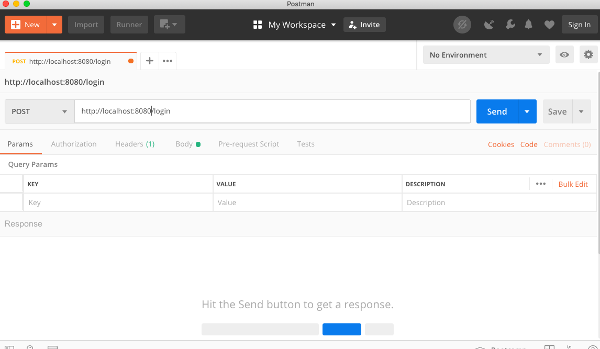
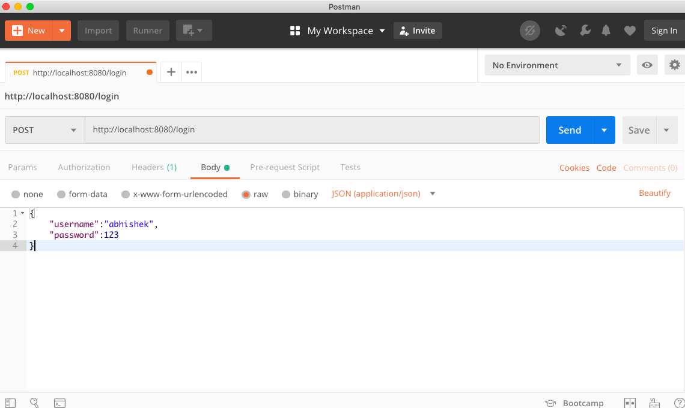

# Node/Express 

Node is a run-time environment for Javascript which is based on chrome V8 engine. You can run your JS programs directly using `node`. Let say your code is in a file `index.js`. To run that file in node :

```javascript

node index.js

```


## Dependencies in Node

In Node we can use any library which is available on `npm` repositories. To initialize a node project, write commands :

```javascript

npm init

```

This will create a `package.json` file in your repository which contains all information about this project, including name, version number, dependencies etc. Here dependencies will contain the NPM libraries you are using in your project.

One can install any library using `npm install` command.

```javascript

npm install <packagename>

```

## Using Node as Web Server

One of the popular use of NodeJS is to use this as the Web server. However that is not what node can only do - but since it is Javascript based - web server seems to be the most popular option. Node has built-in modules for HTTP/HTTPS. However, node has very low-level instructions.

To create a simple server in NodeJS you need to write a lot of lines to send a response packet, like adding headers, adding body and sending final data. There is a better way to do all these in form of Express framework. Let's jump to that

## ExpressJS Framework

ExpressJS is the de-facto standard for web development using NodeJS these days. Express has a minimalistic but a great set of functions used to do server-side coding. It is quite simple to create a simple API using Express.

To install express :

```javascript
npm install express
```

Use ExpressJS in your project, we use `require` to import any library installed using npm, Normal `import` keyword is not supported in nodejs yet:

```javascript
const express = require('express');
```

Let's see the code of a simple server using Express:

```javascript

const express = require("express");
const app = express();

app.listen(8080,function(){
    console.log("server started")
})

```

This server will do nothing but send 404 to any request as it has no end points.

## Creating API using ExpressJS

Let's create a `GET` API endpoint which returns always a simple "hello" string in response.

```javascript

const express = require("express");
const app = express();

app.get("/demo",function(req,res){
    res.send("hello");
})

app.listen(8080,function(){
    console.log("server started")
})

```

Try to call this API in your browser `http://localhost:8080/demo` - this will return a string `"hello"` in response.

To make API return JSON response - just change the response line to  and restart server again:

```javascript
    res.json({name:"hello"});
```

## Request and Response objects

In last example you have seen, two parameters in API callback function - these are `request` object and `response` object of HTTP in nodejs environment.

### Request Object

Request object comprises of many properties, but important ones are :

- Headers : Meta data sent by your browser like browser name, cookies, authentication information etc.
- Query String (url?`name=john`) : This is used in GET requests to send data to server
- Route Params (url/`john`) 
- Body data : This is used in POST and other requests to send data to server

## Response Object

Response object comprises of many properties, but important ones are :

- Headers : Meta data sent by your server back to client like server name, content size, last updated time etc.
- Response status code (`200`, `404`, `403`, `502`)
- Response body : Actual data to be sent to client : HTML, JS, JSON, CSS, Image etc.

## Middlewares

Middlewares are functions which are placed in request and response path and transform the request object data in some way or other.

Middleware is always applied in a sequence, some of the application level middlewares are :

- Static Middleware (express.static) : Used to create static web hosting on your node server (similar to http-server module)
- Logging Middleware (morgan) 
- Compression Middlewares (compress)
- Session Middleware (express-session)
- Authentication Middleware (passportjs)

Middleware can also exist in other forms like 'routing middlewares' but that we will encounter later on.

Let check out an example of `static` middleware. This is used for creating a static hosting of files. So when you have to serve - HTML, CSS, frontend JS. Images and other static resources - you can put them in a hosted directory (public directory)

```javascript

const express = require("express");
const app = express();

app.use(express.static('public'));
app.get("/demo",function(req,res){
    res.send("hello");
})
app.listen(8080,function(){
    console.log("server started")
})

```

This example shows `public` directory is now hosted and we can put static content in that. Now you can put any file in `public` folder and it can be access by  prefixing it with server name.

Example : suppose you have a file `demo.png` in `public` folder it can be accessed by `http://localhost:8080/demo.png` URL in browser or postman.


## POSTMAN API browser

AS you know we can create GET request from any browser using the URL, however it is not easy to create request like POST, PUT, DELETE etc. For that you generally need a form to be created with lots of input boxes which have `name` and `value` attribute set properly. However to test a server response of GET/POST and other request one don't need to put so much of effort.

POSTMAN makes it easy to test API endpoints without creating any HTML or JS Code.

The basic interface of postman looks like. Where you can change URL and also type ot request you want to do. Also you can change query params, form data and other variables in the HTTP request.



You can also pass JSON data in Request body using raw body data, this will be very useful when you will integrate your backend with front-end application which exchange all data in JSON format. (JS objects):


